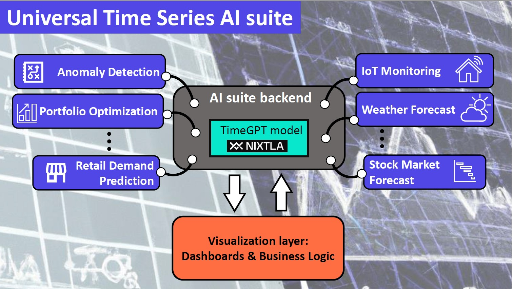

# Universal Forecast AI Suite
This is a universal framework for time series analysis and forecasting powered with TimeGPT foundational model. TimeGPT
relies on a generative pre-trained transformer model specialized in prediction tasks.

## Introduction
Universal Forecast AI Suite is use-case agnostic. It provides an end-to-end
 solution to obtain the forecast of any time series. 

